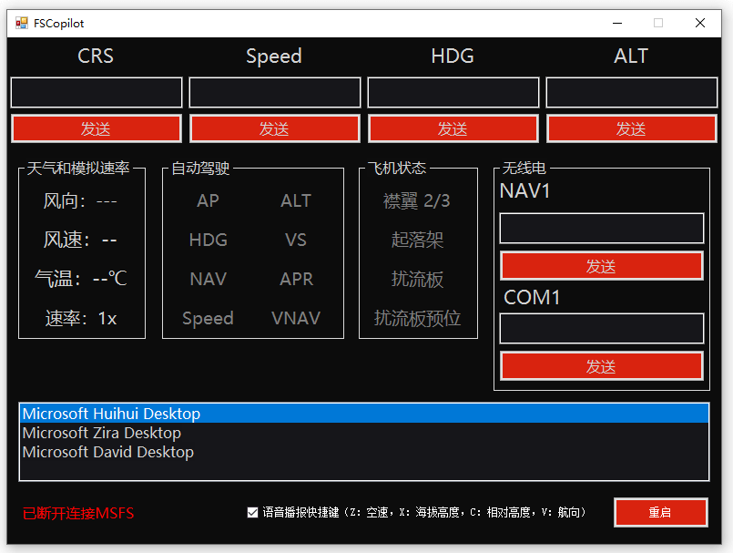

# FSCopilot

Microsoft Flight Simulator 辅助工具，基于 C# + Windows Forms 开发，

通过 SimConnect 与模拟器通信，提供 GPWS 高度提示、飞机状态播报、无线电/自动驾驶控制等功能。

这个项目的大部分代码都是 AI 生成，我只负责设计窗体 UI 和修改调试。

程序目前只测试了 Microsoft Flight Simulator 2020，没有测试 Microsoft Flight Simulator 2024。

## 文件说明

主窗体 `Form1` 使用 `partial class` 按职责拆分为多个文件，便于阅读和维护：

| 文件 | 说明 |
| --- | --- |
| `Form1.cs` | 主窗体核心：窗体生命周期（加载/关闭）、全局快捷键（Z/X/C/V）、语音播报入口（`Speak`）、语音选择、重启应用，以及全部状态跟踪字段 |
| `Form1.Designer.cs` | 窗体设计器生成的界面布局代码，包含所有控件的初始化（VS2022 自动生成，一般不需要手动修改） |
| `Form1.SimConnect.cs` | SimConnect 连接层：数据结构与枚举定义（`SimData`、`DEFINITIONS`、`REQUESTS`、`EVENTS`、`GROUPS`）、连接/断开、后台消息循环、自动重连、数据与异常事件处理、`SendSimEvent` |
| `Form1.GPWS.cs` | GPWS 地面迫近警告逻辑：无线电高度播报（含智能重置与冷却）、地面滑行速度提示 |
| `Form1.AircraftState.cs` | 飞机状态监测：停机刹车、扰流板展开/收起、扰流板预位、襟翼挡位、起落架状态变化播报 |
| `Form1.Autopilot.cs` | 自动驾驶状态监测：主开关、ALT/HDG/VS/NAV/APR 各模式、模拟速率显示、自动油门状态 |
| `Form1.UI.cs` | 界面刷新：连接状态显示、天气信息（风向/风速/气温）显示 |
| `Form1.RadioControls.cs` | 无线电与航向控制：ALT/HDG/CRS/NAV1/COM1 输入按钮的事件处理，以及频率/航向换算工具方法 |
| `Form1.resx` | 窗体的嵌入资源文件（与 `Form1.cs` 关联） |
| `Program.cs` | 应用程序入口，启动主窗体 |
| `Properties/` | 程序集信息、资源与设置文件 |

## 编译说明

- 使用 Visual Studio 2022 打开 `FSCopilot.sln` 即可编译。
- 目标框架：.NET Framework 4.8。
- 依赖 `Microsoft.FlightSimulator.SimConnect.dll` 和 `SimConnect.dll`，已随项目放在根目录。
- 编译完成后检查存放二进制文件的位置是否有 `Microsoft.FlightSimulator.SimConnect.dll` 和 `SimConnect.dll` ，如果没有的话，把这两个文件拷贝到程序目录。

## LICENSE 说明

项目的 MIT License 不包括 Microsoft.FlightSimulator.SimConnect.dll 和 SimConnect.dll。
